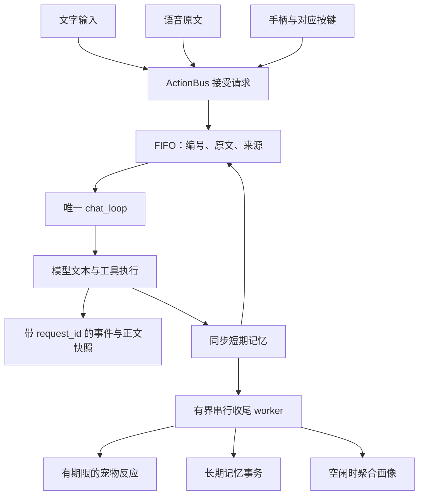

# 对话执行架构

> 更新：2026-10-03。本文描述当前请求执行、窗口协议与后台收尾。

文字、语音和手柄共用一个 FIFO，由 `chat_loop` 逐条执行正文。下一句使用已经同步保存的短期上下文，情绪提取与画像聚合在独立 worker 中运行。

## 请求与执行顺序

[gamepad.rs](../../app/src/gamepad.rs) 的 `accept_chat` 在同一个生命周期锁内分配编号、加入队列并发布排队事件。编号从 1 递增，只标识当前进程内的请求。所有已接受请求保留原文与来源，不因后来的输入而覆盖。

[action_bus.rs](../../app/src/action_bus.rs) 统一接收三类来源；手柄线程负责物理输入和录音状态，正文只由 `chat_loop` 消费。`AiThinking` 从实际执行开始，排队中的按键不会提前改变猫的工作状态。

正文结束时先发送最终快照并释放该请求的生成保护。正常回复和流失败说明的短期记忆同步处理后，循环才开始下一条。收尾任务入队不会等待提取；取消的请求跳过记忆和收尾。

## 窗口协议

[bubble.rs](../../app/src/bubble.rs) 保存正文所有权，并拒绝旧编号追加正文或结束新请求。来源固定为 `text`、`voice`、`gamepad`，`user_text` 是真实请求原文，不包含注入的上下文。

| 接口或事件 | 主要字段 | 作用 |
|---|---|---|
| `cmd_submit_chat` 返回 | `{request_id}` | 确认已接受，可能尚未开始 |
| `bubble-queued` | `{request_id,user_text,source}` | 登记等待，不替换当前问题 |
| `bubble-start` | `{request_id,user_text,source}` | 开始该请求，切换当前问题 |
| `bubble-tool-event` | `request_id` 与既有工具字段 | 更新匹配请求的进度 |
| `bubble-end` | `{request_id,text}` | 不可变最终正文；空串也是最终值 |
| `bubble-cancelled` | `{request_id}` | 取消截止编号，包含该编号 |
| `cmd_get_bubble_snapshot` | `{request_id,user_text,source,text,streaming}` | 冷窗口恢复和流式读取 |
| `cmd_consume_bubble_text` | `Option<String>` | 普通通知文字 |

ACK 和事件到达顺序不能用来猜测归属。前端按编号过滤迟到的结束、工具、取消和轮询结果；排队与接受确认只更新等待信息，实际开始才切换正文。

从未开始请求时，snapshot 的编号、原文和来源为 `null`；完成后保留最近请求的快照。普通通知与聊天正文分别保存。新流按 `activity → pending_text` 的锁顺序清除旧通知；通知也按该顺序检查生成或交互保护，不改写聊天快照。

冷窗口优先恢复仍在生成的请求。已有完成快照和较新通知同时存在时，先缓存聊天再展示通知，主动打开聊天后恢复。输入、阅读和生成分别受到保护；旧请求的守卫不会释放下一轮状态。

## 停止边界

`cmd_cancel_chat` 可接收 `throughRequestId`，省略时取后端最新编号。停止覆盖所有编号小于或等于截止值的在途与排队请求，更晚接受的请求继续执行。迟到的停止不会降低已经记录的取消上界。

`Notify` 唤醒 `tokio::select!` 并丢弃当前流 future，停止后续模型步骤与工具调用。生成保护在实际退出后释放，输入草稿和已收到的正文保留。已经发出的系统操作、保存的提醒或记忆、开始的外部朗读不能自动撤销。

## 后台收尾与聚合

[chat_reaction.rs](../../app/src/chat_reaction.rs) 使用一个串行 worker，等待队列容量为 **16**，另有至多一个正在处理的任务。饱和时跳过可选收尾并记 `warn`，正文不等待；显式 `remember` 仍在工具执行时同步保存。

`AgentReaction` 提取超时为 **8 秒**。情绪展示期限从正文完成计时，上限 **10 秒**；过期、取消、关机或已有新请求时抑制旧反应。最新编号检查与发送共用提交、取消的生命周期锁，避免检查后再被新会话插入。展示被抑制时，仍有效的记忆候选可继续按原策略保存。

画像聚合只在 worker 空闲时检查，网络调用限 **15 秒**。`memory_v2.aggregation_interval_min=0` 关闭聚合；非零时沿用原阈值：至少 20 条未聚合记忆，或已有画像且达到配置间隔，并且有待聚合条目。

开始尝试前登记重试期限。读取、配置、提取或提交失败均保留该期限，按配置的分钟间隔冷却；成功和未达阈值时清除期限。冷却不阻止收尾任务处理，也不占用正文的生成保护。

## 长期记忆持久化

[core/src/memory.rs](../../core/src/memory.rs) 的 `load_checked` 严格读取最新 JSONL；缺失文件为空，损坏或读取失败明确返回错误。每轮上下文重新读取并更新缓存，避免遗漏上一轮 `remember` 的写入。

`update_latest` 在同一个进程内锁中完成“读取最新记录 → 修改 → 原子保存”。`remember`、候选、删除与聚合标记共用此事务；闭包不能包含网络请求或重入持久化 API，缓存不能直接覆盖文件。

主文件 `long_term.jsonl` 原子替换成功即提交。派生 `long_term.md` 更新失败记录 `stage=derived_markdown` 和错误，事务仍返回成功，避免把已保存的记忆误报为失败。

聚合只标记分析快照中的仍有效 ID，不标记期间新增的记忆，也不复原删除。画像先在副本上验证，来源提交成功后才保存画像并更新缓存；画像保存失败记录部分提交并尝试重置这些 ID 的聚合标记，供后续重试。

该锁只协调**同一进程**。两个应用进程或外部编辑器同时写同一数据目录时，不保证避免更新丢失；原子文件替换不提供跨进程的读改写事务。

## 体验与验收

操作说明见[AI 对话与记忆](../guide/ai-chat.md)，语义映射见[宠物事件架构](pet-semantic-events.md)。焦点、IME、DPI、滚轮与混合输入按[Windows 对话验收](../guide/chat-native-validation.md)执行，具体记录见[本轮验收记录](../research/chat-native-validation-2026-10-03.md)。
