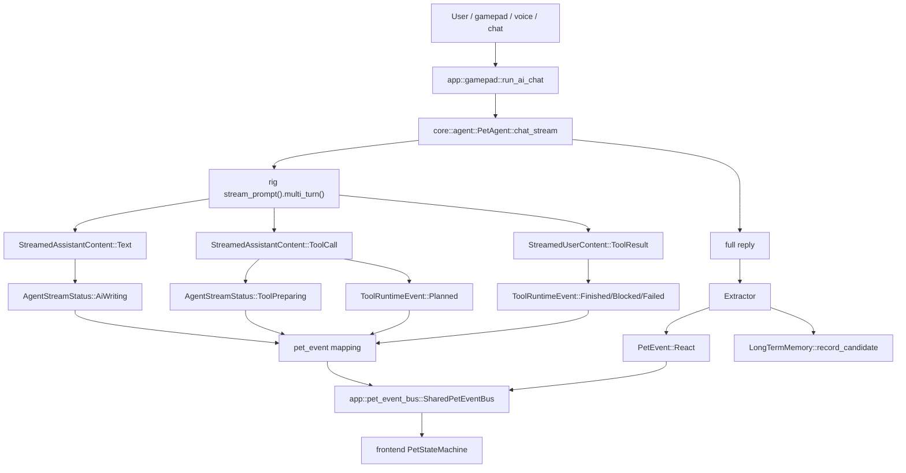

# Pet Semantic Events Architecture

> Updated: 2026-05-30
> Status: implemented through Phase 6

This document describes the current semantic event pipeline that connects rig streaming, tool lifecycle events, final reactions, memory candidates, and the pet frontend.

## Goals

The pet should react to what the agent is doing, not to guessed keywords in the final text. The core split is:

- rig/model layer decides semantic behavior: tool calls, final mood, useful memory candidates.
- Rust app/core layer owns protocol, validation, permissions, lifecycle, logging, persistence, and scheduling.
- Frontend owns visual presentation: mapping semantic events to animation states.

The old `SetState(Happy/Talk/Confused)` style path has been removed from the AI mainline. The stable app-to-frontend protocol is `PetEvent`, serialized as a tagged JSON payload on `pet-event`.

## End-To-End Flow



## Core Protocol

`core/src/pet_event.rs` defines the app/frontend contract.

| Event | Purpose |
|---|---|
| `Notify` | Short-lived status notification with optional TTL and refresh semantics. |
| `ClearNotification` | Clears one notification kind or all notifications. |
| `React` | Final emotional reaction after a task or conversation, optionally with speech and TTL. |
| `SetMode` | Long-lived mode such as `Sleep` or `GamePlay`. |
| `WalkTo` / `ShowBubble` / `PlayDance` / `Exit` | Explicit action commands. |

Notification kinds currently include:

- `AiThinking`: request started, no stream signal yet.
- `AiWriting`: rig text stream has started.
- `ToolPreparing`: rig tool-call item has arrived; the model is preparing/issuing a tool call.
- `ToolRunning`: a concrete tool call has been planned and is executing or awaiting result.
- `ToolBlocked`: permission or policy blocked a tool call.
- `ToolFailed`: tool result indicates failure.
- `Listening`: voice capture is active.
- `ScreenshotObserving`: screenshot analysis is active.

## Rig Integration

`core/src/agent.rs` consumes rig `MultiTurnStreamItem` directly:

- `StreamedAssistantContent::Text` emits `AgentStreamStatus::AiWriting` once per writing segment, then emits `AgentStreamEvent::Text` chunks for bubble rendering.
- `StreamedAssistantContent::ToolCall` emits `AgentStreamStatus::ToolPreparing`, then a `ToolRuntimeEvent` with `ToolPhase::Planned`.
- `StreamedUserContent::ToolResult` resolves the planned event into `Finished`, `Blocked`, or `Failed`.
- `FinalResponse` usage is recorded through token tracking.

rig 0.36 also exposes `PromptHook::on_text_delta()` and `PromptHook::on_tool_call_delta()`. The project currently does not need a custom hook for UI status because `MultiTurnStreamItem` already provides the stream nodes needed by the pet. Hook-level integration remains an option if future UI needs argument-delta previews or earlier provider-level deltas.

## Event Bus And Mood Policy

All app-side pet events should go through `app/src/pet_event_bus.rs`.

`SharedPetEventBus` responsibilities:

- emit `pet-event` to the frontend;
- apply `MoodPolicy` to `React` events;
- deduplicate repeated events in a short window;
- record the most recent 50 decisions for diagnostics;
- expose `cmd_get_pet_event_log` for the settings UI.

`core/src/mood_policy.rs` responsibilities:

- add default TTL to `React`;
- preserve explicit TTL;
- throttle repeated low-priority reactions;
- allow higher-priority reactions to override quickly.

The settings window displays the event log under the usage tab. Decisions are:

- `sent`
- `deduplicated`
- `throttled`
- `emit_failed`

## Frontend State Machine

`app/frontend/js/pet.js` keeps the visual mapping local to the pet window.

Current visual mapping:

| Semantic state | Visual state |
|---|---|
| `AiThinking` | `talk` |
| `AiWriting` | `talk` |
| `ToolPreparing` | `preparing` |
| `ToolRunning` | `talk` |
| `ToolBlocked` | `confused` |
| `ToolFailed` | `confused` |
| `Sleep` mode | `sleep` |
| `GamePlay` mode | `gameplay` |
| `Happy` / `Caring` / `Excited` moods | `happy` |
| `Focused` mood | `focused` |
| `Sleepy` mood | `sleep` |

Notification events temporarily override reaction mood. Long-lived modes such as `Sleep` and `GamePlay` have higher priority than notifications. `React.ttl_ms` lets final mood expire back to idle/current semantic state.

## Final Reaction And Memory

After the main reply completes, `core/src/agent_reaction.rs` runs a rig `Extractor<AgentReaction>` with an 8-second timeout. It returns:

- `mood: PetMood`
- `speech: String`
- `memory_candidates: Vec<MemoryCandidate>`
- `followups: Vec<String>`

Failure or timeout falls back to `Idle` and no memory candidates. This prevents the secondary extractor from blocking the user-visible response.

Long-term memory is now driven by structured `memory_candidates`, not keyword rules. `LongTermMemory` stores:

- `summary`
- `tags`
- `importance`
- `source`
- original truncated user/assistant text
- stable `id`, `created_at`, and soft-delete `deleted`

It exposes `retrieve_with()` for text/tag/source/importance filtering and `review_entries()` / `review_markdown()` for human-readable review. Settings uses `cmd_get_memory_review` / `cmd_delete_memory_entry` to list entries and soft-delete them by stable id. Rust only recalls up to 20 grep-first candidates; the model decides semantic relevance. The design intentionally avoids embeddings/vector RAG.

The main Agent also exposes two semantic memory tools:

- `search_memory`: grep-first retrieval with text, tags, source, importance, and character-budget filters.
- `remember`: explicit long-term note creation with normalized tags and clamped importance.

The main Agent also exposes low-risk performance tools:

- `perform_dance` / `play_dance`: dance request bridge to the app layer.
- `start_game`: starts one built-in minigame through `core::game_request` and the app `ActionBus`; it does not generate code or bypass game validation.

## Testing

Relevant coverage:

- `core/src/pet_event.rs`: serialization snapshot, agent status mapping, tool lifecycle mapping.
- `core/src/mood_policy.rs`: TTL defaults, explicit TTL, throttling, priority override.
- `app/src/pet_event_bus.rs`: mood TTL preparation, deduplication, event log snapshots.
- `core/src/agent_reaction.rs`: sanitization and fallback behavior.
- `core/src/memory.rs`: JSONL candidate storage, filtered retrieval, review markdown, deletion by stable id.
- `core/src/tools.rs`: `search_memory` and `remember` argument parsing and execution.
- `core/src/tools.rs`: `start_game` argument parsing and request dispatch.
- `app/src/action_bus.rs`: built-in game kind to action mapping.
- `app/src/settings.rs`: memory review/delete IPC serialization.
- `app/frontend/__tests__/pet.test.js`: notification mapping, reaction TTL, mode priority.

Recommended verification after touching this path:

```powershell
cargo run -p xtask -- test-core
cargo check -p bitcat-app
cargo nextest run -p bitcat-app
cd app/frontend && npx vitest run
```

## Extension Points

Next likely improvements:

- evaluate hook-level `on_tool_call_delta()` only if argument-delta previews are needed;
- consider `ask_user_confirmation` before expanding low-level shell usage;
- add settings-side editing or tag cleanup only if manual review starts needing it.
