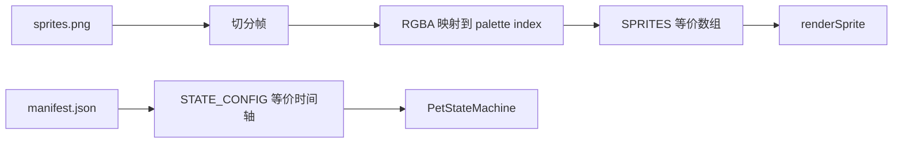

# 宠物 Spritesheet Manifest 计划

> 归档说明：本文记录 v1 设计和早期迁移路径，已不代表当前实现。当前代码是 v2-only 资源包模式，默认加载 `piggy`，`cat` 是普通可选包；后续发布与体积策略见 [`../pet-asset-packaging.md`](../pet-asset-packaging.md)。

> 状态：Phase A/B 已落地，Phase C 待做
> 更新日期：2026-05-17

本计划定义从当前 `sprite.js` 硬编码像素数组，迁移到外部、可由美术编辑的宠物资产格式的路径。当前已经落地 `default-cat` fixture、`sprite-loader.js` 和 manifest timeline 接入；下一步重点是设置页选择、用户目录加载和预览诊断。

## 目标

让宠物视觉资产数据化，同时保留当前内置 16x16 小猫的可靠性。

期望的最终状态：

- 内置 sprite 数据仍是安全 fallback；
- 外部宠物可以提供 `manifest.json` 和 spritesheet 图片；
- 动画时间轴、idle variants 和基础元数据放进 manifest；
- 用户最终可以不改 `app/frontend/js/sprite.js` 就添加新宠物；
- 前端能加载和渲染外部资产，同时继续保留语义化 `PetEvent` 行为。

## 非目标

- 不替换语义事件管线；`PetEvent`、`MoodPolicy` 和前端视觉映射继续保留。
- 不引入 embeddings、AI 自动选资产或运行时生成美术。
- 不要求 Rust 渲染 sprite。
- 在外部加载稳定前，不移除当前硬编码 sprite。
- 本次迁移不把舞蹈做成一等 `PetState` 变体。

## 当前约束

本地宠物渲染器目前默认：

- 每个 sprite frame 是 16x16 逻辑像素；
- `SPRITES[state][frame]` 返回一个长度为 256 的调色板索引数组；
- `renderSprite()` 通过固定 palette 绘制像素；
- `PetStateMachine` 输出视觉状态和 frame index；
- `renderMini()` 取当前状态第 0 帧，并裁剪头部区域；
- `PerformerHost` 可能渲染 `jump`、`spin`、`wave`、`shake` 等动作 sprite。

Manifest v1 应该贴合这个模型，而不是强迫重写渲染器。

## 资产布局

外部宠物资产应该放在用户数据目录下，而不是 app bundle 内：

```text
~/.bitcat/pets/
  default-cat/
    manifest.json
    sprites.png
  dog/
    manifest.json
    sprites.png
```

App bundle 仍然通过 `sprite.js` 携带内置小猫。以后可以把内置小猫也导出成 bundled manifest 以保持一致，但第一版 loader 不需要依赖这一步。

## Manifest v1

第一版 schema 应保持小而明确。

```json
{
  "schemaVersion": 1,
  "id": "default-cat",
  "displayName": "Default Cat",
  "description": "The built-in built-in cat exported as a manifest-compatible pet.",
  "sprite": {
    "image": "sprites.png",
    "frameWidth": 16,
    "frameHeight": 16,
    "columns": 32,
    "rows": 1,
    "frameCount": 32
  },
  "palette": {
    "0": null,
    "1": [30, 30, 40, 255],
    "2": [255, 180, 140, 255],
    "3": [255, 220, 190, 255],
    "4": [40, 35, 50, 255],
    "5": [255, 120, 140, 255]
  },
  "states": {
    "idle": {
      "spriteFrames": [0, 1, 2, 3, 4, 5, 6],
      "frames": [
        { "sprite": 0, "duration": 1500 },
        { "sprite": 1, "duration": 120 },
        { "sprite": 2, "duration": 200 },
        { "sprite": 1, "duration": 120 },
        { "sprite": 0, "duration": 1800 }
      ],
      "loop": true,
      "variants": [
        {
          "name": "ear_twitch",
          "weight": 3,
          "cooldownMinMs": 8000,
          "cooldownMaxMs": 16000,
          "frames": [
            { "sprite": 4, "duration": 180 },
            { "sprite": 0, "duration": 140 }
          ]
        }
      ]
    },
    "focused": {
      "spriteFrames": [7, 8, 9, 10],
      "frames": [
        { "sprite": 7, "duration": 700 },
        { "sprite": 8, "duration": 140 },
        { "sprite": 7, "duration": 520 },
        { "sprite": 9, "duration": 120 }
      ],
      "loop": true
    },
    "happy": {
      "spriteFrames": [10, 11],
      "frames": [
        { "sprite": 10, "duration": 250 },
        { "sprite": 11, "duration": 120 },
        { "sprite": 10, "duration": 230 }
      ],
      "repeat": 3,
      "fallback": "idle"
    }
  },
  "actions": {
    "jump": { "sprite": 20 },
    "spin": { "sprite": 21 },
    "wave": { "sprite": 22 },
    "shake": { "sprite": 23 }
  },
  "mini": {
    "state": "idle",
    "frame": 0,
    "headRows": 10
  }
}
```

### 必需状态

只有包含以下状态的 manifest 才应视为有效：

- `idle`
- `walk`
- `sleep`
- `talk`
- `happy`
- `confused`
- `focused`
- `preparing`
- `gameplay`
- `gamewin`
- `gamelose`

v1 不对这些状态做隐式 fallback。外部 pack 如果缺状态，应拒绝整个 manifest 并回到内置宠物，避免运行时出现局部外部、局部内置的混合视觉。

## Loader 行为

推荐加载顺序：

1. 从设置中读取当前宠物 id。
2. 尝试读取 `~/.bitcat/pets/<id>/manifest.json`。
3. 校验 manifest schema 和引用的 sprite 图片。
4. 将 `sprites.png` 加载到 offscreen canvas。
5. 根据 `frameWidth`、`frameHeight` 和 `columns` 切帧。
6. 把每一帧转换成当前渲染器使用的 palette-index 数组。
7. 构建运行时等价的 `SPRITES` 和 `STATE_CONFIG`。
8. 任何必需步骤失败时，记录 warning 并使用内置 sprite 数据。

v1 loader 应该采用 all-or-nothing 策略。局部加载外部资产很容易造成难排查的混合状态。

`spriteFrames` 是每个 state 的完整帧表，用于还原 `SPRITES[state]` 的局部帧索引；`frames[].sprite` 和 variant `frames[].sprite` 仍引用 spritesheet 的全局帧索引。没有 `spriteFrames` 时，loader 可退化为只用 timeline 中出现过的帧，但 idle variants 这类“被状态机按局部 index 触发”的帧会丢失，所以 fixture pack 应始终写出 `spriteFrames`。

## 校验规则

以下情况应拒绝 manifest：

- `schemaVersion` 不是 `1`；
- v1 中 `sprite.frameWidth` 或 `sprite.frameHeight` 不是 `16`；
- `frameCount` 超过 `columns * rows`；
- 任意 state 的 `frames` 数组为空；
- 任意 state 缺少 `spriteFrames`，或 `spriteFrames` 为空；
- 任意 frame 引用的 sprite index 不在 `[0, frameCount)` 范围内；
- 任意 duration `<= 0`；
- `repeat` 存在但不是正整数；
- `fallback` 引用了不存在的 state；
- variant 的 cooldown max 小于 cooldown min。

以下情况只 warning，不拒绝：

- 存在未知顶层 metadata 字段；
- 存在当前 app 未引用的额外 state。

## 渲染策略

v1 保留现有 palette-index 渲染器：



这样可以避免重写 `renderSprite()`，也能让现有测试继续有意义。如果未来 palette 量化限制太多，v2 再考虑直接渲染图片帧。

## Rust / Frontend 边界

v1 保持前端拥有视觉资产加载逻辑。

Rust 继续发送语义事件：

- `Notify`
- `React`
- `SetMode`
- `WalkTo`
- `PlayDance`

前端把这些事件映射到 manifest states。Rust 不需要知道 sprite index。

后续可选增强：

- 只有当设置页需要在打开宠物窗口前预览或拒绝外部宠物时，才增加 Rust 侧小型 manifest validator；
- 为诊断页生成精简的 state/timeline 摘要。

## 迁移计划

### Phase A：Schema 与测试 fixture

- [x] 将 manifest schema 固化为文档。
- [x] 创建一个镜像当前内置小猫的 fixture manifest。
- [x] 增加一个小型 fixture spritesheet。
- [x] 增加校验成功/失败测试。

### Phase B：带 fallback 的 loader

- [x] 新增 `sprite-loader.js`。
- [x] 如果配置了外部宠物，则尝试加载。
- [x] 任意失败时回退到当前 `sprite.js` 数据。
- [x] 保持公开 renderer API 稳定。
- [x] 将 manifest `stateConfig` 接入 `PetStateMachine`，让外部 timeline、repeat/fallback 和 idle variants 真正生效。

### Phase C：设置页与预览

- [ ] 增加设置页宠物 id 选择入口。
- [ ] 用易懂文案展示校验错误。
- [ ] 使用同一条 `renderSprite()` 路径提供预览。
- [ ] 将正式用户资产路径收敛到 `~/.bitcat/pets/<id>`，保留 query/localStorage 作为开发入口。

### Phase D：导出内置资产

- [x] 把当前小猫导出成 manifest-compatible asset pack。
- [ ] 至少发布一个带 loader 的版本后，再考虑是否弱化 `sprite.js` fallback。

## 待决策问题

- 自定义宠物正式入口使用 `~/.bitcat/pets`；开发期继续允许 query/localStorage 指向 project-local fixture。
- v1 要求 palette，暂不支持直接 RGBA 图片渲染。
- 外部宠物允许独立覆盖 performance action sprites。
- v1 固定 16x16 frame，暂不支持 32x32 或 scale factor。
- Manifest 校验只放前端，还是也通过 Rust 设置命令执行？

## 推荐下一步

下一步进入 Phase C：把外部宠物选择做成可用的设置页能力。推荐先支持用户目录：

```text
~/.bitcat/pets/default-cat/
  manifest.json
  sprites.png
```

设置页应列出可用 pack、显示 manifest 校验结果，并用同一条 `SpriteRenderer.renderSprite()` 路径预览 `idle` / `talk` / `focused` / `preparing` / `gamewin` / `gamelose`。
